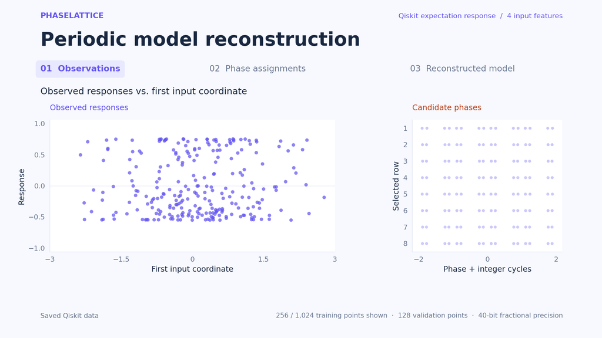
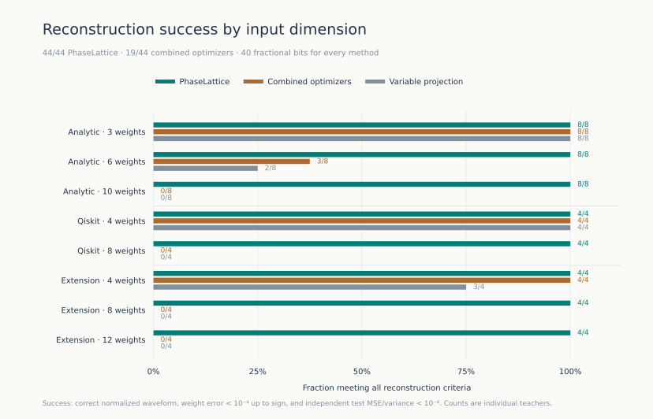

# PhaseLattice

**Periodic model reconstruction by phase-list lattice decoding.**

PhaseLattice reconstructs a hidden weight vector and an unknown harmonic waveform
from input/output observations. It exports the inferred equation as a NumPy
predictor, a differentiable PyTorch module, and a Qiskit circuit with the same
measured response.



An eight-second animation of a recorded Qiskit reconstruction. The points move
from the first input coordinate to the inferred phase. Phase assignments come
from the verified trace.
[Static view](docs/media/reconstruction.svg) · [1080p video](docs/media/reconstruction.mp4)

The method combines certified inverse-phase bands, exact rational linear algebra,
and LLL lattice reduction. Each output admits several phases and cycle counts;
the decoder resolves them jointly through the linear relations shared by all
observations. An exact output-range filter removes impossible waveforms before
the lattice calculation.

This repository implements selected phase-list decoding for a **known finite
family of periodic single-index models**. The particular waveform and weights
are hidden. The benchmark family contains 62 waveforms of degree at most three.
The benchmark observations use 40 fractional bits.

## Results

The evaluation separates reconstruction from prediction: success requires the
correct normalized waveform, weight error below 1e-4 up to sign, and test
MSE/variance below 1e-6. All methods receive the same 1,152 public observations
per model. An additional 2,048 observations are reserved for evaluation.

| Evaluation | PhaseLattice | Combined optimizers |
|---|---:|---:|
| Original 32 models | 32/32 | 15/32 |
| Extension: 12 new models | 12/12 | 4/12 |
| **Total** | **44/44** | **19/44** |

The comparison includes multistart Levenberg–Marquardt, inverse-phase projection,
harmonic transfer, and 1,024-start variable projection. The optimizer portfolio
chooses its output by validation loss. The difference in reconstruction rates
is largest at higher input dimensions.



Recovered equations also reproduce gradients and Hessian-vector products on
four input distributions, without derivative observations during learning.
The quantum evaluation uses 11 Qiskit circuits to generate observations. See the
[results and controls](docs/results.md), [evaluation protocol](docs/protocol.md),
and [machine-readable evidence](evidence/README.md).

## Run the demonstration

Python 3.11 or newer is required. The numerical stack is tested on Linux.

```bash
python -m venv .venv
source .venv/bin/activate
python -m pip install -e '.[research,dev]'
phaselattice demo --output runs/demo
```

The demo generates observations from a Qiskit circuit, passes them to a
separate inference process, verifies the reconstruction trace, and evaluates the
exported model on new inputs. It writes an executable `model.py`, a Qiskit `.qpy`
circuit, and an evaluation record. `--provider analytic` generates observations
from the harmonic equation directly. The process boundary separates interfaces;
it is not a security sandbox.

## Python interface

```python
import numpy as np
from phaselattice import reconstruct

result = reconstruct("runs/demo/observations.json")
if result.recovered:
    model = result.model
    x = np.zeros((8, len(model.weights)))
    predictions = model.predict(x)
    gradients = model.gradient(x)
    torch_module = model.as_torch()
    circuit, observable, features = model.as_qiskit()
    model.export("runs/model.py")
```

The exported file is independent of this package. It exposes `predict`,
`gradient`, `hessian_vector_product`, `as_torch`, and `as_qiskit`.
The circuit reconstructs the measured response, not a unique original gate
sequence or quantum state. Follow the [executed walkthrough](examples/reconstruction.ipynb)
or consult the [API and data format](docs/interface.md).

```bash
phaselattice recover runs/demo/observations.json --output runs/reconstruction.json
phaselattice verify runs/demo/observations.json runs/reconstruction.json
phaselattice export runs/reconstruction.json --output runs/model.py
```

## Method and scope

The response has the form

$$f(x)=\sum_{j=1}^{D}\frac{k_j}{Q}\cos\!\left(2\pi j\,\theta^\top x\right),
\qquad \sum_j |k_j|=Q.$$

For a candidate waveform, an observation constrains its hidden projection to
`theta · x = integer + sign × phase[branch]`. Selected observations share one
weight vector, so their possible projections must satisfy a common set of
linear relations. The lattice encodes those relations together with the
discrete branch, sign, and winding choices. A valid short vector yields an
explicit rational least-squares solution. Held-out observations select among
candidate waveforms.

The method uses **selected phase-list decoding with an unknown waveform**.
The code also provides independent trace verification and model export. The
[mathematical walkthrough](docs/method.md) explains the construction and its
assumptions. The [research context](docs/references.md) credits prior work on
periodic-neuron learning, variable projection, and quantum model extraction.

In the shot-noise controls, the lattice decoder returns unresolved for all six
datasets. Variable projection meets the approximate-prediction threshold on all
six. These experiments test reconstruction within the specified model family;
they do not demonstrate hardware-noise robustness or quantum advantage.

## Reproduce and inspect

```bash
pytest
ruff check .
python benchmarks/run.py --device cpu --output runs/benchmark
python benchmarks/figures.py
python benchmarks/audit.py
```

The optimizer comparison supports GPU execution with `--device cuda`.
The repository includes observations, held-out data, per-case results, source
hashes, and scripts to regenerate SVG/PDF figures. See
[reproduction instructions](docs/reproduction.md) for the pinned environment,
individual stages, and timing conventions.

Core entry points: [decoder](src/phaselattice/decoder.py),
[exact algebra](src/phaselattice/algebra.py),
[trace verification](src/phaselattice/verification.py), and
[optimization controls](src/phaselattice/baselines).

Licensed under [MIT](LICENSE). Cite the software using [CITATION.cff](CITATION.cff).
