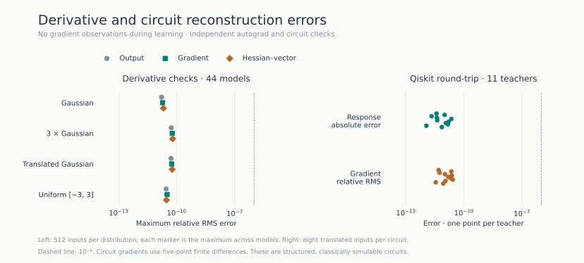
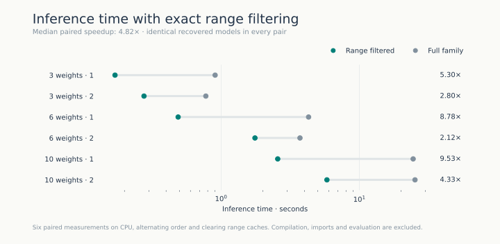
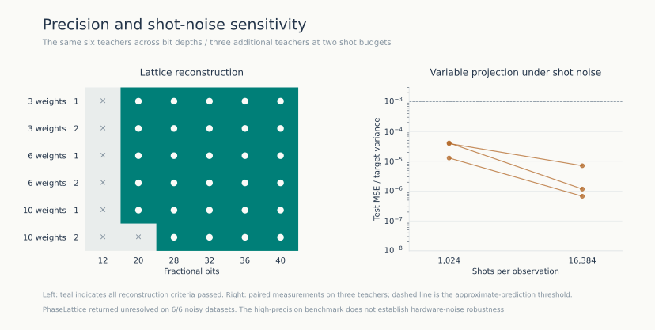

# Measured results

This page and its figures are generated from the saved measurements by
`python benchmarks/figures.py`. The [protocol](protocol.md) defines the cohort,
algorithm budgets, thresholds, and timing conventions. The
[evidence index](../evidence/README.md) links to individual records.

## Recovery

| Cohort | PhaseLattice | Variable projection | Combined optimizers |
|---|---:|---:|---:|
| Analytic · 3 weights | 8/8 | 8/8 | 8/8 |
| Analytic · 6 weights | 8/8 | 2/8 | 3/8 |
| Analytic · 10 weights | 8/8 | 0/8 | 0/8 |
| Qiskit · 4 weights | 4/4 | 4/4 | 4/4 |
| Qiskit · 8 weights | 4/4 | 0/4 | 0/4 |
| Extension · 4 weights | 4/4 | 3/4 | 4/4 |
| Extension · 8 weights | 4/4 | 0/4 | 0/4 |
| Extension · 12 weights | 4/4 | 0/4 | 0/4 |
| **Total** | **44/44** | **17/44** | **19/44** |

Success requires the correct normalized waveform, weight error below `1e-4`
up to sign, and test MSE/variance below `1e-6`. Every method receives the same
1,024 training and 128 validation observations at 40 fractional bits. Test
scoring uses a separate 2,048 observations. Variable projection is also a
member of the combined optimizer portfolio, so these columns are not independent.

PhaseLattice recovered more models than the optimizer portfolio in this benchmark.
The comparison is limited to this model family, observation precision, and
optimization budgets. Successful optimizers can estimate the weights more precisely
than the lattice decoder. The difference in reconstruction rates is largest at
higher input dimensions.

## Derivatives and Qiskit

All 44 recovered equations are evaluated on four distributions,
with 512 points per distribution. 44/44
pass the gradient and Hessian-vector criterion on every distribution.
The largest relative RMS error across these derivative checks is **6.23e-11**.

The 11 Qiskit teachers use at most three qubits. The largest absolute
response difference between original and reconstructed circuits is
**2.24e-11**; the largest gradient
relative RMS error against circuit finite differences is
**2.67e-11**.
The circuit reconstruction reproduces the measured response; the underlying
gate sequence is not identifiable from these observations.

The circuits are structured and classically simulable. These checks test response
and gradient agreement within the specified circuit family. They do not
demonstrate quantum advantage or reconstruction of arbitrary quantum models.

## Exact filtering

On six paired analytic cases, removing range-incompatible waveforms gives a
**4.82× median speedup** over the same decoder with filtering disabled.
Every pair returns the same rational model and a valid reconstruction trace.
Each pair was measured once on the recorded workstation, with alternating
execution order and range caches cleared before each run. These timings may vary
with hardware and process load.

## Precision and negative controls

| Fractional bits | Recovered |
|---:|---:|
| 12 | 0/6 |
| 20 | 5/6 |
| 28 | 6/6 |
| 32 | 6/6 |
| 36 | 6/6 |
| 40 | 6/6 |

Each row reuses the same six teachers; this is a paired precision sweep.
The single-relation ablation recovers 4/6
teachers. Independently shuffled labels recover
0/6.

| Shots | Lattice recovered | Variable projection: approximate prediction | Variable projection: strict reconstruction | Maximum test MSE/variance |
|---:|---:|---:|---:|---:|
| 1,024 | 0/3 | 3/3 | 0/3 | 4.14e-05 |
| 16,384 | 0/3 | 3/3 | 1/3 | 7.11e-06 |

The shot-noise experiment has three independent teachers, each measured at two
shot budgets. Approximate prediction means test MSE/variance below `1e-3`,
whereas strict reconstruction retains all three original criteria.

## Recorded environment

The recorded run used Python 3.11.15, NumPy 2.2.6,
PyTorch 2.5.1+cu121, and Qiskit 2.3.0.
Optimization ran on NVIDIA GeForce RTX 2080 Ti; lattice reduction ran on CPU.
The [manifest](../evidence/run/manifest.json) records source and data hashes,
library versions and platform information. The [audit](../evidence/audit.json)
rechecks observations, reconstruction traces, selection rules, and scores.
